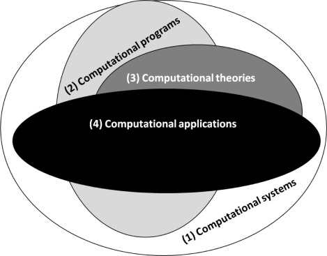
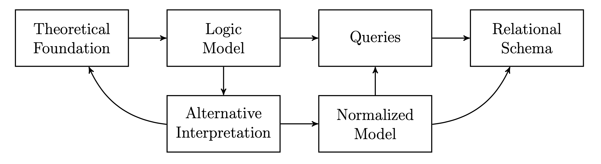

```{r setup, include=FALSE}
knitr::opts_chunk$set(
  echo = FALSE, # By default, hide code; set to TRUE to see code
  fig.pos = 'th', # Places figures at top or here
  out.width = '100%', dpi = 300, # Figure resolution and size
  fig.env="figure"
) # Latex figure environment

# install.packages("bibliometrix")
library(bibliometrix)

layout="l-body-outset"
library(rmarkdown)

options(knitr.table.format = "latex") # For kable tables to write LaTeX table directly
```

```{r, include=F, warning=F}
## set up, load libraries
library(dplyr)
library(readtext)
library(tidyverse)
library(here)
library(gt)
library(ggplot2)
library(dplyr)
library(knitr)
library(kableExtra)
here::i_am("population-level-data-humanitarian.Rmd")
```

***Abstract*** **--- This paper presents a relational modeling computational framework for leveraging population-level data to explore varying humanitarian and justice-oriented perspectives. The framework aims to improve the general engagement with highly contextualized data, enabling learners to examine globally-scaled humanitarian issues and consider national-level justice-oriented perspectives. We build on Traore's (2017) framing of Computational Systems Components to enhance understanding of various computational practices and social issues and perspectives that may be viewed in both local and global contexts. Our evaluation demonstrates how relational data modeling supports critical analysis and computational literacy, contributing to a more nuanced understanding of how we analyze complex societal issues.**

***Keywords: census, data, literacy, population, statistics***

# Introduction

The expanding discourses around data science and computational data analysis have increased the use of large-scale data sets as an instructional aid in secondary and post-secondary settings. These increases have resulted in the development of computational tools to examine new data sets at the global, national, and local levels. Despite these advances, less work has been done to support the development and implementation of conceptual frameworks and data science educational practices that account for the local and geographically specific contexts in which data is gathered, analyzed, and situated. The recent expansion of and new engagements with socially-relevant data has come as a result of the increase in interdisciplinary learning opportunities afforded across disciplinary areas by data science. The broadening use of geographically specific data has emerged with need and also as a result of the potential of this data to provide culturally relevant and responsive entry points as a pathway to more authentic engagements within computation and critical thinking about the various approaches scholars use to address humanitarian issues and social justice perspectives.

Educators, however, often face challenges at various points along the data cycle, particularly when dealing with local or geographically specific data that is highly contextualized and challenges the development of additional insights beyond generate considerations. These challenges include a diversity of factors such as difficulties in finding relevant or related data, understanding issues around data provenance, and assessing data accuracy as insights are developed. Still, the relevance and quality of these data can vary significantly depending on the priorities and data collection methods of different agencies. Government agencies, non-profit organizations, and academic institutions may have different standards and objectives in making data available, which can impact completeness. Furthermore, educators may lack the necessary skills or resources to effectively clean, analyze, and interpret complex data sets. The issue of data provenance—understanding where data comes from and how it has been processed—is particularly crucial when dealing with sensitive justice orientations or politically charged topics related to humanitarian issues [@burns2015rethinking]. As a result, there is a need for more opportunities that allow educators to develop the competencies required to critically evaluate data sources, understand the nuances of data provenance, and design learning modules that make effective use of accurate and relevant data. This approach enhances student engagement with computation and critical thinking and also fosters a more nuanced approach to how different perspectives and priorities shape the data analysis in humanitarian and social justice oriented research projects.

The purpose of this paper is to outline a computational framework on how the authors leveraged population-level data to explore various humanitarian and justice-oriented perspectives, while addressing the challenges faced by researchers and educators in engaging with complex data sets. By integrating relational data modeling with a focus on both global and local contexts, this framework aims to enhance our understanding of processes and the development of culturally relevant and responsive learning opportunities for a more critical engagement with and analysis of data. As educators address the increasing intricacies of theories about the broader society, that can be inferred through population-level data, various theoretical perspectives serve as markers for interdisciplinary learning, promoting the further use of data science in addressing complex societal issues. The framework, however, has the potential to create new insights about how we approach data from different perspectives that consider context and content. Several questions emerge:

**Modeling related data**. How does the integration of relational modeling enhance the ability to explore humanitarian and justice-oriented perspectives using population-level data?

**Considering the context**. What impact does the use of geographically specific data have on engagement with and understanding of complex societal issues?

**Quantification**. How can a computational framework address the challenges of data provenance and accuracy when working with theories about society and population-level data from diverse sources?

In this study, we sought to understand how a computational framework based on relational modeling enhances a research community's ability to critically analyze and interpret population-level data in the context of both global humanitarian perspectives and context-specific justice-oriented perspectives. We explore how members of a research community effectively engage with and make sense of information across different theoretical boundaries. When an analysis intersects both global and national issues, a unique opportunity arises to examine the interplay between macro and micro levels of theory and data analysis, revealing insights into the role of theory in computational thinking and supporting a nuanced understanding of social issues. This paper aims to contribute to the growing body of knowledge on data literacy and its implications for developing socially conscious, analytically skilled users capable of framing global and local challenges.

# Conceptual Frameworks

## Perspective and Social Issues

Humanitarian and justice-oriented perspectives are both concerned with human welfare but they differ in their scope, focus, and underlying principles. Humanitarian perspectives, in our analysis, often addresses immediate, globally-scaled crises and efforts related to these perspectives aim to alleviate suffering through direct aid and intervention. These approaches are generally guided by principles of humanity, impartiality, neutrality, and independence, focusing on urgent needs without necessarily addressing the root causes of issues. This prompts a narrative on which formation of justice any given project seeks to analyze [@tuck2018toward].

Justice-oriented perspectives, on the other hand, are often rooted within local and national histories and specific contexts. These perspectives seek to address systemic inequalities based on various historical injustices, and the related and underlying social, economic, and political structures that perpetuate the identified disparities. In some conceptions, humanitarian efforts are seen as a means to provide immediate relief whereas justice-oriented approaches aim for long-term, theoretically-grounded sustainable changes in societal structures and in power dynamics.

When each perspective overlaps and interacts, as they often do in complex global issues, the "relational modeling" framework can be valuable for addresing the different entry-points that scholars and researchers may be use to analyze some complex issue. This approach acknowledges the interconnectedness of global humanitarian concerns and more localized issues of justice, allowing for a more nuanced analysis that ofter relies on the background and context connecting the issues. Relational modeling in this context would involve examining how global humanitarian efforts interact with and impact justice concerns at more micro levels, and vice versa. The justice orientation would consider how immediate relief efforts might support or hinder long-term structural changes, and how local initiatives might even inform effective and equitable global humanitarian responses. This framework challenges us to think beyond traditional boundaries of theory and practice, recognizing that effective solutions to any given problem often require addressing both immediate needs and systemic issues simultaneously.

## Problem-based Active Learning

Problem-based active learning (PBAL) is underutilized in traditional computational and statistical data analysis courses. Traditional courses and methods often rely on point-and-click software tools that are more process- and product-oriented than they are on creativity- and learning-orientations that make computation an active enterprise in the analytic process [@deyasi2021computational]. PBAL intersects problem-based learning, or PBL, a learner-centered approach where students work in groups and respond to open-ended questions; and active learning, or AL, which uses instructional methods to engage students in course material through a variety of pedagogical practices – such as case studies, experiential learning trips, gallery walks, role plays, and the like. The result is a dynamic learning praxis that considers perspective to support active skill development through the use of real-world problems, authentic questions, and simulated scenarios in the form of case studies; together, they generate a dynamic learning environment for computational pedagogy as well [@gupta2022design; @ishaq2023advances]. Dynamic lab spaces of this nature provide authentic engagement with material that also supports focused interactions between peers [@fennell2020toward], as well as with students and faculty (Kokotsaki, Menzies, & Wiggins, 2016; Livingstone & Lynch, 2002).

## Computational Systems

@traore2017introduction Computational Systems Components makes sense of the dynamic sources of information that come into play in a computational learning space. The framework outlines the multiple and various overlays between different computational systems and identifies core computational components that should be central to what Traore focuses on in Computational Science and Engineering (CSE) education, but the applications can extend to other areas of study. The framework explores the interdisciplinary nature of CSE and highlights the importance of developing students' ability to apply computational and database thinking across domains [@ishaq2023advances].

The layered model addresses some of the challenges in implementing CSE education, including the need for appropriate resources and faculty training. It explores how computational thinking can enhance students' understanding of complex systems and processes, particularly through the use of simulation and modeling. Traore's framework provides a structured approach to incorporating computational frameworks into diverse disciplines, emphasizing the role of these skills in advancing scientific and engineering knowledge.

Traore's model also offers a view into the overlapping but distinct categories of computational systems. The model aligns with our goal of developing a computational framework that enhances educators' and researchers' ability to analyze and interpret complex data sets across different contexts and settings. By applying Traore's (2017) emphasis on interdisciplinary problem-solving in the use of computational tools, we address a nuanced framing of global and local issues, supporting the development of culturally relevant and responsive learning modules in mathematical and related computational contexts [@ladson1995toward; @ladson2014culturally; @tate1995returning]. As we explore how members of a research community can effectively engage with multifaceted information across theoretical boundaries, Traore's (2017) model provides a foundation for enhancing computational literacy and critical analysis skills in the context of pressing societal challenges.

{width="35%"}

While the primary contribution of the systems framing helps with the development of a theoretical foundation to support views of data systems that would engage with and support perspectives on local and global communities, this initial work also included a series of short-term focused activities centered around implementation - which resulted in the framework presented in this paper. Specifically, we developed a problem-based active learning framework that considers the importance of interdisciplinarity [@nasir2021rethinking] in data science that helped establish a community data program and a series of projects and project ecosystem analyses. Initial programming centered around how to develop methods to engage with and support research on local, national, and global communities. We discuss the implementation of our problem-based active learning framework which resulted in the relational data modeling schema developed by the authors.

A primary objective of the early conceptual work was to identify others and subsequently outline a framework that would inform materials around a series of case studies to advance student learning through problem-based inquiries in a dynamic lab setting. We are, in essence, considering the "theory-to-practice" relation often discussed as a consequence of new theoretical developments. The project objectives were accomplished by outlining learning activities that would result in a series of materials for PBAL in data science.

## A Relational Data Modeling Schema

Relational data modeling provides a structured approach to organizing and representing data, aligning with the complex needs of analyzing population-level data for humanitarian and justice-oriented perspectives. This enhanced model incorporates interconnected components that link theoretical foundations to logic models and queries, allowing for alternative interpretations and flexible data exploration. It maintains data integrity and consistency while minimizing redundancy, facilitating efficient queries and robust relational schemas. This approach enables effective management and retrieval of large-scale population data, representing real-world relationships logically. By supporting critical analysis across theoretical boundaries, the model allows researchers and educators to engage with multifaceted information, revealing insights into macro and micro levels of theory and data analysis. Ultimately, this framework contributes to developing analytically skilled individuals capable of addressing global and local challenges through data-driven approaches.

The approach connects, at the primary level, a theoretical foundation to a relational schema through the various computational systems to be used. The computational systems are based on the components identified in @traore2017introduction: first, the computational system; second, the computational programs; third, the computational theories; and, fourth, the computational applications. This process is a dynamic engagement with the data and the other components help to bookend any prior or other theoretical necessities generated by the focus and level of analysis.

$$ \text{Theoretical Foundation} \rightarrow \text{Computational Systems} \rightarrow \text{Relational Schema} $$

Figure 2 presents a more granular view of this process:

*Theoretical Foundation to Logic Model to Queries*: This pathway represents the translation of abstract concepts and theories into concrete data structures and queries. It begins with the theoretical underpinnings of humanitarian and justice-oriented perspectives, which inform the creation of a logic model. This model then guides the development of specific database queries to extract relevant information.

*Alternative Interpretations*: These can feed back to the theoretical foundation, encouraging a cyclical process of theory refinement. Alternatively, they can lead to a normalized model or directly to new queries, allowing for flexible exploration of data from different viewpoints.

*Normalized Model to Queries or Relational Schema*: This component ensures data integrity and consistency while minimizing redundancy, a key principle of relational modeling. It facilitates the creation of efficient queries and robust relational schemas.

*Queries to Relational Schema*: This connection represents the practical implementation of data retrieval and analysis within the structured database environment.

{width="45%"}

Our present conceptual analysis aims to explore how computational frameworks based on relational modeling enhance the ability to critically analyze and interpret population-level data in the context of humanitarian issues and justice-oriented perspectives. This inquiry is driven by the need to bridge the gap between global-scale humanitarian concerns and national or local-level justice issues, as more data becomes available, while leveraging the power of data science and computational thinking. By developing a flexible and comprehensive framework, we provide educators and researchers with tools to engage more deeply with complex societal challenges across different scales and theoretical boundaries.

# Methods and Data

For this analysis, we engaged in a content review of the various materials, data, code books, and archives that were generated as a part of the various data scientific processes engaged in over the course of a two year period. To help frame the large collection of materials, we focus on a core problem situated in our early analysis through the use of the case study method. The case study method allowed us to consider the various research tools and analytic framework that were used to situated the collection, documentation, and analysis of data. These various materials informed the findings presented for the current analysis.

**Case study method**. Case studies support learners' familiarity with data wrangling, coding, and analysis. To provide for more active engagement, case studies can frame real-world content through discussions, experiential learning, as well as audio and visual content (Zayapragassarazan & Kumar, 2012). In our analysis, case studies supported learners in a set of target areas over the course of time for the given case: (1) cleaning data for analysis and visualization, (2) computing and reporting statistical analyses, (3) visualizing data, and (4) communicating and storytelling with data.

Case studies also help integrate problem solving practices that allow learners to make sense of and respond to real-life situations and simulated scenarios. Experiential learning, short presentations, and components such as large-group feedback, support an active space that centers peer learning as well as a mutual respect of open ideation and exploration. As learners engage in case studies, the conceptualization of ideas supports the a familiarity with data wrangling, coding, and analysis, while also providing critical assessment for leaders to experience dynamic content learning and ideation interact. Case studies also support learners with developing a methodology for cleaning data for analysis and visualization, considering theory in computing and how they might report statistical analyses, and communicating and storytelling with data using informed theories through a process of a literature review.

**Lab setting**. Our analysis contains information from virtual and hybrid lab engagements two to three times per week for one hour over the course of three academic semesters and one summer. There was a slightly different focus for each meeting. Meetings focused on a collaborative group project, individual projects, and as a space to share out and discuss progress for the week and prepare plans for the subsequent week. In developing the lab space, faculty members were invited to engage with and observe students during a mock data science process in a Group Interview Day (GID). GID was developed around a case study focused on an authentic Homelessness Act proposed at the state-level. Learners were provided with a prompt and a set of data and information to provide recommendations to a fictional community board. This contributed to the launch of a PBAL model for the lab.

**Group projects**. Given that our program centered on a host of community issues, learners and faculty mentors worked on a data-centered project in response to a local policy issue related to policing. This project resulted in the development of an original database and the analysis of data that turned into a series of related project. All learners were able to engage in a full data science project cycle, from the development of research questions, to coding, to final analysis and conclusions.

**Individual projects**. In addition to a group project, all learners engaged in an individual project based on their major interests in relation to data analysis. Students engaged a host of software programs and data collection and analysis efforts. Students also learned basic statistics and some advanced probability methods as taught by the program leaders and TAs.

## Data

Our inquiry leverages multiple data sources to develop a comprehensive framework for analyzing population-level data in the context of humanitarian and justice-oriented perspectives [@cantor2003promoting]. Central to our approach is the integration of the Washington Post's Fatal Force database, which provides detailed information on fatal police shootings in the United States since 2015. This database, recognized for its thoroughness and public accessibility, offers a crucial foundation for examining justice-oriented issues at the national and local levels.

**Washington Post Fatal Force Database**. Our analysis of fatal police interactions in the United States provided for an initial examination of the justice-oriented perspectives. The United States' Washington Post's Fatal Force Database began in 2015 in response to the heightened focus on police accountability following the 2014 killing of Michael Brown in Ferguson, Missouri. This database tracks fatal shootings by on-duty police officers in the United States, providing a more complete picture than official federal records. It collects information from various sources, including news reports, law enforcement websites, social media, and independent databases, often supplemented by additional reporting. The database includes crucial details such as the race of the deceased, circumstances of the shooting, whether the person was armed, and if they were experiencing a mental health crisis. In 2022, it was updated to include standardized names of police agencies involved in each shooting, enhancing accountability measures. Publicly accessible and regularly updated, the Fatal Force Database has a disproportionate number of unarmed victims being Black. This project has become an invaluable resource for researchers, journalists, and the public, significantly contributing to the ongoing discourse on police use of force and accountability in the United States. This database, like others of its nature (see, e.g., @comer2023comparing) represents population-level police interactions.

**United States Census Data**. The US Census microdata, also known as Public Use Microdata Sample (PUMS), consists of anonymized individual-level records derived from Census surveys, including the decennial Census and the American Community Survey (ACS). This dataset contains detailed responses to survey questions, enabling more in-depth analysis than pre-tabulated aggregate data. The ACS PUMS covers approximately 1% of the U.S. population in 1-year files and 5% in 5-year files. The data is available for states and Public Use Microdata Areas (PUMAs), which are geographic regions containing at least 100,000 people. New accessibility to the data is a key resource for teaching and learning, as PUMS data can be obtained through the Census Bureau's FTP site, the data.census.gov MDAT tool, and via API, making it compatible with many new analytical tools. This database represents population-level information on individuals and local units.Researchers use microdata to create custom estimates, perform cross-tabulations not available in aggregated data, and conduct individual-level analyses. However, there are limitations, such as the restriction on geographic detail to larger areas (PUMAs) and a smaller sample size compared to the full American Community Survey (ACS).

**Global data**. The availability and quality of data on fatal police interactions vary significantly across the globe, presenting a challenge for comprehensive international comparisons and analysis. While some countries, like the United States, have seen increased efforts in recent years to track and report such incidents through both official and non-governmental sources, many nations lack systematic data collection or transparent reporting mechanisms. This disparity is often attributed to differences in governance structures, legal frameworks, cultural attitudes towards policing, and the various resources allocated to data collection. For example, the Fatal Police Shootings database by the Washington Post is supported by a non-profit effort. In many countries, official statistics on police-involved fatalities may also be underreported, inconsistently recorded, or not publicly accessible. The absence of standardized definitions and reporting protocols further complicates cross-national comparisons. This global data sparsity hinders efforts to fully understand the scope of fatal police interactions worldwide, impedes evidence-based policy-making, and limits the ability to identify and address potential systemic issues in law enforcement practices across different cultural and political contexts. As a result, researchers and policymakers face additional challenges in relational modeling and developing a comprehensive global perspective on social issues, such as police use of lethal force and its impacts on communities.

**An original Database**. To address the dearth of data and the complex interplay between humanitarian and justice-oriented perspectives, we developed an original data set that could integrate diverse data sources that was assessed through our relational modeling framework. We developed the dataset by combining the Washington Post's Fatal Force database with demographic and socioeconomic data accessed through the tidycensus R package, which provides U.S. Census Bureau information. We then used archival sources to generate specific variables of interest through a sourcing and scoping process not covered in this paper. This integration allowed for a more nuanced analysis of the contexts in which police shootings occur, enabling us to explore potential relationships between characteristics and incidents of fatal force at the state-level and local level. We also incorporated various historical and systemic factors, such as the legacy of confederate states, into our database to provide a deeper contextual understanding. This original data set was structured according to the computational systems components at the national level, with the extension of the relational modeling framework, our analysis allowed us to examine the intersections between global humanitarian issues and local justice concerns. By creating a database, we were able to bridge the gap between different scales of analysis and theoretical perspectives, providing a holistic view of some of the approaches to analyzing complex societal challenges, in this case police force and its broader global implications.

## Research tools

Our inquiry used various research tools in developing and applying a computational framework that enhances the analysis and interpretation of theory to population-level data. This approach prioritizes the preparation and implementation of analytical tools to support the application of our relational data modeling framework. Code book development allowed us to consider how a comprehensive documentation that define variables, data types, and relationships across different scales of analysis informed some of the foundation of theory and the related components of structure and scale. These codebooks also served as a bridge between theoretical concepts and their operational definitions in the data. The various analytical tools, prepared scrips and notebooks with pre-written code and documentation, helped to guide our team through various analytical processes, from data cleaning to advanced statistical analyses. We also conducted an extensive archival analysis to develop an original database that integrates information from various other sources. The detailed process involved:

1.  Data integration: We merged the Fatal Force data with U.S. census information and other relevant data to create a more comprehensive picture of level and context.

2.  Codebook development: We created detailed codebooks to standardize variable definitions across different data sources, ensuring consistency in our analyses. We looked over the course of a five year period (2017-2022).

3.  Database development: We developed a data process that was ultimately identified through the relational schema, which allows for flexible querying across different scales (global to local) and perspectives (humanitarian to justice-oriented).

4.  Data cleaning and validation: We then implemented a community-oriented cleaning procedures to address inconsistencies and missing data across the integrated sources. This process allowed for the further clarification of theory and analysis.

## Analytic Framework

The analytic framework was informed by two core lenses: a *global-scale humanitarian issues examination*, for example, the international police-to-population ratios and the global incarceration rates. We then used a U.S. *national-level justice-oriented perspectives* to discuss data related to racial disparities in fatal police shootings and various socioeconomic factors in our framing of the history of and data related to policign and incarceration. The humanitarian lenses offered content for examining the United States of America on a global scale whereas the justice-oriented lenses offered the lens to examine the United States of America's laws, policies and practices in the national and even state context.

# Findings

## Comparative analysis of global and national perspectives

Based on our comparative analysis of global humanitarian approaches to data analysis and national justice-oriented perspectives, we found significant intersections in the archived data between global trends in police use of force and local patterns in the United States. By integrating the Washington Post's Fatal Force Database with US Census microdata through our relational modeling framework, we uncovered complex relationships between community characteristics and incidents of fatal police shootings. Our analysis revealed that areas with higher poverty rates and greater racial diversity often experienced disproportionately higher rates of fatal police interactions, a pattern consistent with global humanitarian concerns about systemic inequalities. However, we also identified unique national and local factors, such as the historical legacy of confederate states, that influenced these outcomes in ways not typically captured in global data sets. This nuanced integration of global and national perspectives highlighted the importance of considering both broad humanitarian issues and specific justice-oriented concerns when addressing police use of force in computational methods. Our findings suggest that effective interventions in pedagogy can be situated to help students simultaneously address global patterns of inequality and violence while also accounting for localized historical and systemic factors. This approach provides a more comprehensive understanding of the complex societal challenges surrounding police use of force and offers a foundation for developing more targeted and effective policy responses at both global and national levels.

### Defining a relational schema for highly contextualized data

The study of information is a complex enterprise. Information theory is often used to frame and understand the function of new information obtained through computational models, but its interpretation depends on philosophical domains or social contexts. Currently, a set of classification models, including neighborhood counting methods (e.g., k-nearest neighbor, decision trees), are used to generate similarity indices. There are typically two types of learners in classification: "lazy" learners and "eager" learners. Lazy learners store information and match data to the most related data in a training set, while eager learners construct a classification model prior to receiving data for classification. In these approaches, various interpretations of probability intersect with computational methods under the umbrella of Machine Learning Classifiers. As noted in figure 2, relational scheme on data and evidence are subject to interpretation via their theoretical foundations. These foundations inform a logic model on the various queries that can be run through data simulations. These logic models are also subject to alternative interpretations that, in turn, can re-engage the relational data modeling process shown above. Overall, these processes and logic models inform a set of queries that are taken in their original context, or in some normalized setting. Altogether, these processes come together to form a relational schema on data use based on the interpretations of information.

The core objective of our study is to examine the formulation of contextual probabilities and mass functions for computational methodologies. Despite the ability of modern interpretations to generalize the axioms of probability, as described by , this class of interpretable functions has not been widely explored and is not well documented in contemporary literature at the intersection of probability theory and computational methodologies. Moreover, these functions have not been framed in relation to the theoretical foundations of alternative interpretations.

As noted in Figure 2, relational schemes on data and evidence are subject to interpretation via their theoretical foundations. These foundations inform a logic model on the various queries that can be run through data simulations. These logic models are also subject to alternative interpretations that, in turn, can re-engage the relational data modeling process shown above. Overall, these processes and logic models inform a set of queries that are taken in their original context or in some normalized setting. Altogether, these processes come together to form a relational schema on data use based on the interpretations of information.

# Discussion and Conclusion

Our study has demonstrated the value of integrating global humanitarian perspectives with national justice-oriented approaches through a relational data modeling framework. By combining the Washington Post's Fatal Force Database with US Census microdata, we were able to uncover complex relationships between community characteristics and incidents of fatal police shootings. This integration revealed patterns that are consistent with global humanitarian concerns about systemic inequalities, while also highlighting unique national and local factors that influence outcomes in ways not typically captured in global datasets.

The relational schema we developed for highly contextualized data proved to be a powerful tool for bridging the gap between macro-level humanitarian issues and micro-level justice concerns using computational tools for the social sciences [@cioffi2017computation] . This approach allowed us to examine how global trends in police use of force compare to national and local patterns in the United States, considering factors such as race, socioeconomic status, and historical legacies. Our findings suggest that effective interventions must simultaneously address broad patterns of inequality and violence while also accounting for localized historical and systemic factors. This nuanced understanding can inform more targeted and effective policy responses at both global and national levels.

However, our study also highlighted the challenges inherent in working with sparse and inconsistent data on fatal police interactions globally. The lack of standardized reporting and data collection methods across different countries limits our ability to make comprehensive international comparisons. Future research should focus on developing more robust and standardized data collection methods globally, which would enable more accurate cross-national analyses. Additionally, further exploration of the interpretable functions at the intersection of probability theory and computational methodologies could enhance our ability to analyze and interpret complex, contextualized data. Despite these limitations, our study demonstrates the potential of relational data modeling to provide a more comprehensive understanding of complex societal challenges, paving the way for more informed and effective approaches to addressing issues of police violence and community safety.

# References

\newpage

# Appendix
