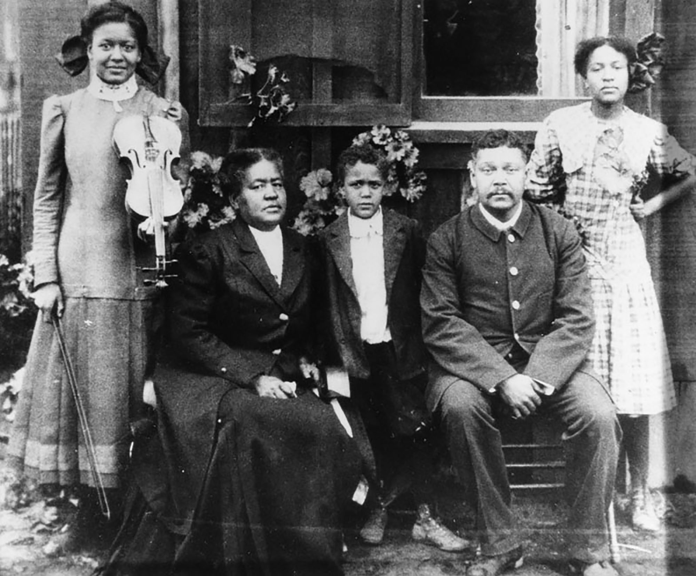

The **CENSUS HISTORY PROJECT** focuses on the exploration, extraction, and analysis of U.S. Census data for further research purposes. Our users group takes on a critical historical approach to understanding population-level data on the United States, the methods used to gather the data, and the measures applied to explore, extract, and analyze the data.

[{width="1000"}](https://caamuseum.org/learn/600state/black-history/blackhistory-on-june-1-1900-the-first-census-of-the-20th-century-counted-2-131-black-angelenos)

#### Group Info

group: census-users

initiated: fall 2022

#### Project PIs

-   Nathan Alexander (Howard University)
-   Hye Ryeon Jang (Morehouse College)
-   Christopher Agbonkhese (Bates College)

#### Contributors

-   Sayid Achilov (Brown University)
-   Myles Ndiritu (Morehouse College)
-   Jibek Gupta (Howard University)
-   Zoe Williams (Howard University)
-   Maxwell Messiah (Dalton)
-   Bayowa Onabajo (Howard University)

#### Funding

Funding for this project is provided by [Data.org](https://data.org) and the [Alfred P. Sloan Foundation](https://sloan.org).

**Ancillary files**:

-   [`api.R`](https://github.com/quant-shop/census/blob/main/code/api.R) helps new users generate and store a [US Census API key](https://api.census.gov/data/key_signup.html).

    -   You should never share your Census API key. Follow the steps below:

        -   Set up an environment variable to hold your api key with `usethis::edit_r_environ()`

        -   Transfer information into `.Renviron` (pop-up file)

            -   Insert `CENSUS_API_KEY='your_api_key'` into the `.Renviron` file

        -   Insert your census API key via `Sys.getenv("CENSUS_API_KEY")`
